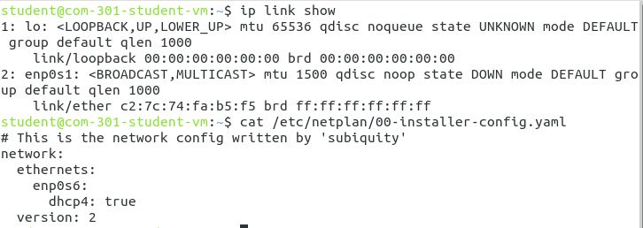
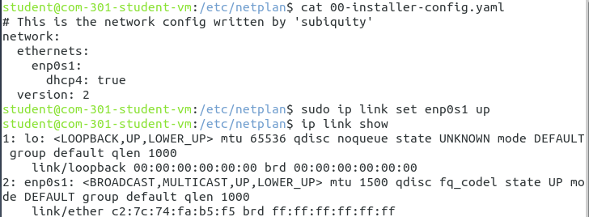
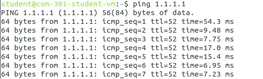
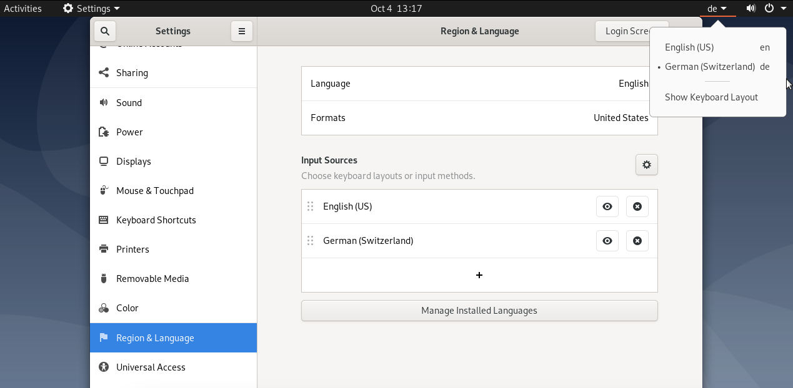
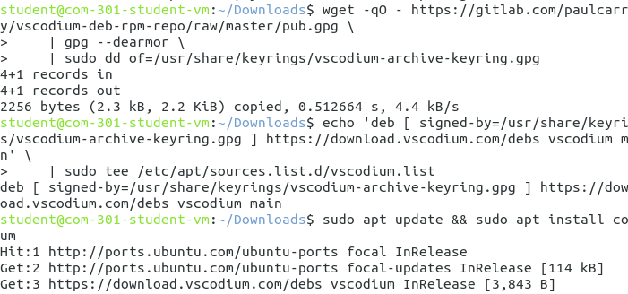

# FAQs of VMs

*Last Update: 04.10.2023*

#### 1. "Failed to access data from shortcut" 

**Problem** Download the VM from the COM-301 homework website, then doubleclick the extracted utm file, UTM application shows an error saying "Failed to access data from shortcut" 

**Solution** After searching for the error message, this is [a known issue of UTM](https://github.com/utmapp/UTM/issues/3801). As [this reply](https://github.com/utmapp/UTM/issues/3801#issuecomment-1434050071) says, run the following command to delete the metadata file will solve the problem: 

```
rm ~/Library/Containers/com.utmapp.UTM/.com.apple.containermanagerd.metadata.plist
```

#### 2. No network connection in the VM

**Problem** the VM has problem reaching the internet, e.g., 

```
student@com301-stuent-vm:~$ ping 1.1.1.1
ping: connect: Network is unreachable
```

**Solution** This is because the hardware emulation order changes (see the documentation from the [official UTM guide](https://docs.getutm.app/guides/ubuntu/#networking-is-unavailable)), so the names of network interfaces are mismatched. Run the following two commands and notice the mismatched `enp0s1` and `enp0s6`:



*The above screenshot should be the case if the host device is MacOS, the interface information is in the file under path `/etc/netplan/00-installer-config.yaml`. For other OS, the file can be in other paths, e.g., `/etc/network/interfaces`*

There are three steps required to fix this network issue. 

First, we edit the names in the interface file (`/etc/netplan/00-installer-config.yaml` or `/etc/network/interfaces`) to make sure it is consistent with the output of `ip link show`:
```
student@com301-stuent-vm:~$ sudo nano /etc/netplan/00-installer-config.yaml
```

Edit the file, save the changes and close the file. 

Second, bring up the real interface (`enp0s1` in our example):
```
student@com301-stuent-vm:~$ sudo ip link set enp0s1 up
```

To check the changes in the first two steps are actually correct: 



Last, reboot the VM, you can do it using the power off button or just type in the terminal:
```
student@com301-stuent-vm:~$ reboot
```

Now, the network issue should be solved, verify it by: 



#### 3. Non-english keyboard

**Problem** the keyboard of the VM does not match with the keyboard of host device, which makes it really hard to type some special charaters like `-` in a command

**Solution** In the VM, go to right up corner, click the `Settings` -> `Region & Language` -> `Input Source`, click the `+` at the bottom, add an English keyboard input, e.g., `English (US)`. Then we should be able to see the English keyboard is added as an input source. Then click the keyboard icon at the top to choose from the keyboards, as the following screenshot:



#### 4. No code editor

**Problem** It is very clumsy to edit code via terminal, an editor would be more convenient. 

**Solution** There are many code editors, and you are free to choose the one you prefer. We use `vscodium` as an example tool in the following. 

First, open firefox on the VM, go to the downloading page of `vscodium`: [https://vscodium.com/#install-on-debian-ubuntu-deb-package](https://vscodium.com/#install-on-debian-ubuntu-deb-package)

Second, follow the instructions to run:

```
student@com301-stuent-vm:~$ wget -qO - https://gitlab.com/paulcarroty/vscodium-deb-rpm-repo/raw/master/pub.gpg \
    | gpg --dearmor \
    | sudo dd of=/usr/share/keyrings/vscodium-archive-keyring.gpg
student@com301-stuent-vm:~$ echo 'deb [ signed-by=/usr/share/keyrings/vscodium-archive-keyring.gpg ] https://download.vscodium.com/debs vscodium main' \
    | sudo tee /etc/apt/sources.list.d/vscodium.list
student@com301-stuent-vm:~$ sudo apt update && sudo apt install codium
```



After the installation is finished, you can open `vscodium` by click on the icon or just run: 

```
student@com301-stuent-vm:~$ codium .
```

Now you have the code editor, enjoy ;)


